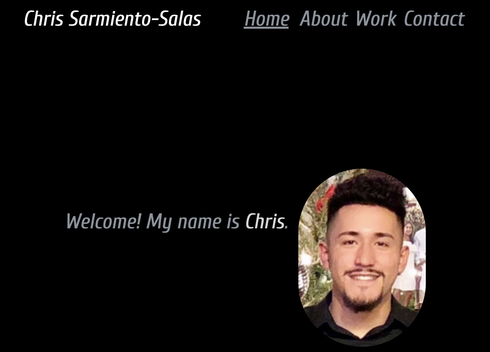

# React Portfolio- Weekly Challenge 20

## Table of Contents

- [Description](#description)
- [Installation](#installation)
- [Usage](#usage)
- [Tests](#tests)
- [Credits](#credits)
- [License](#license)

## Description

The challenge this week was to create a single page application using React.js for my own portfolio to show off my work. Tailwind and Tailwind Elements were used to style the page along with some plain CSS. 

Below is a preview of the deployed site:

## Installation

If you clone the repository to your machine, run the command `npm install` in order to install all needed npm packages.

## Usage

To view the portfolio, in the project directory, you can run:

### `npm start`

OR 

you can visit the [deployed site](https://chris-15.github.io/React-Portfolio/).

## Tests

No tests were conducted for this application.

## Credits

- Various Classmates
- TA's
- [Node.js Documentation](https://nodejs.org/en/docs/)
- [React.js Documentation](https://reactjs.org/docs/getting-started.html)
- [Tailwind Documentation](https://tailwindcss.com/docs/installation)
- [Tailwind Elements Documentation](https://tailwind-elements.com/quick-start/)
- [React Icons Documentation](https://react-icons.github.io/react-icons)
- [Google Fonts](https://fonts.google.com/specimen/Cuprum)

## License

MIT License

Copyright (c) [2022] [Christopher Sarmiento-Salas

Permission is hereby granted, free of charge, to any person obtaining a copy
of this software and associated documentation files (the "Software"), to deal
in the Software without restriction, including without limitation the rights
to use, copy, modify, merge, publish, distribute, sublicense, and/or sell
copies of the Software, and to permit persons to whom the Software is
furnished to do so, subject to the following conditions:

The above copyright notice and this permission notice shall be included in all
copies or substantial portions of the Software.

THE SOFTWARE IS PROVIDED "AS IS", WITHOUT WARRANTY OF ANY KIND, EXPRESS OR
IMPLIED, INCLUDING BUT NOT LIMITED TO THE WARRANTIES OF MERCHANTABILITY,
FITNESS FOR A PARTICULAR PURPOSE AND NONINFRINGEMENT. IN NO EVENT SHALL THE
AUTHORS OR COPYRIGHT HOLDERS BE LIABLE FOR ANY CLAIM, DAMAGES OR OTHER
LIABILITY, WHETHER IN AN ACTION OF CONTRACT, TORT OR OTHERWISE, ARISING FROM,
OUT OF OR IN CONNECTION WITH THE SOFTWARE OR THE USE OR OTHER DEALINGS IN THE
SOFTWARE.

